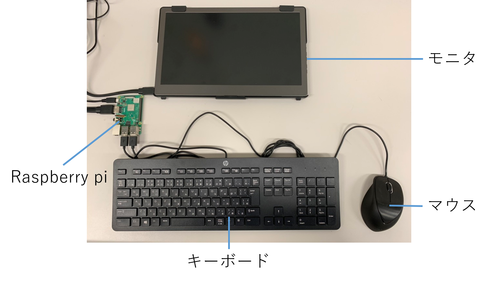
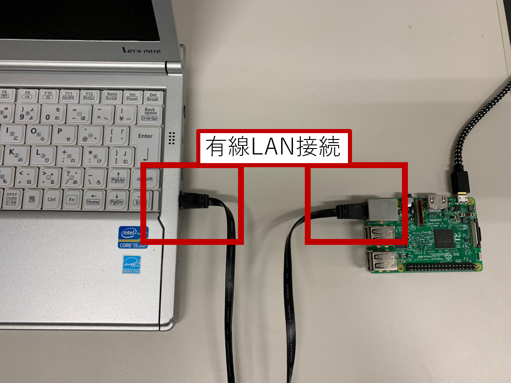
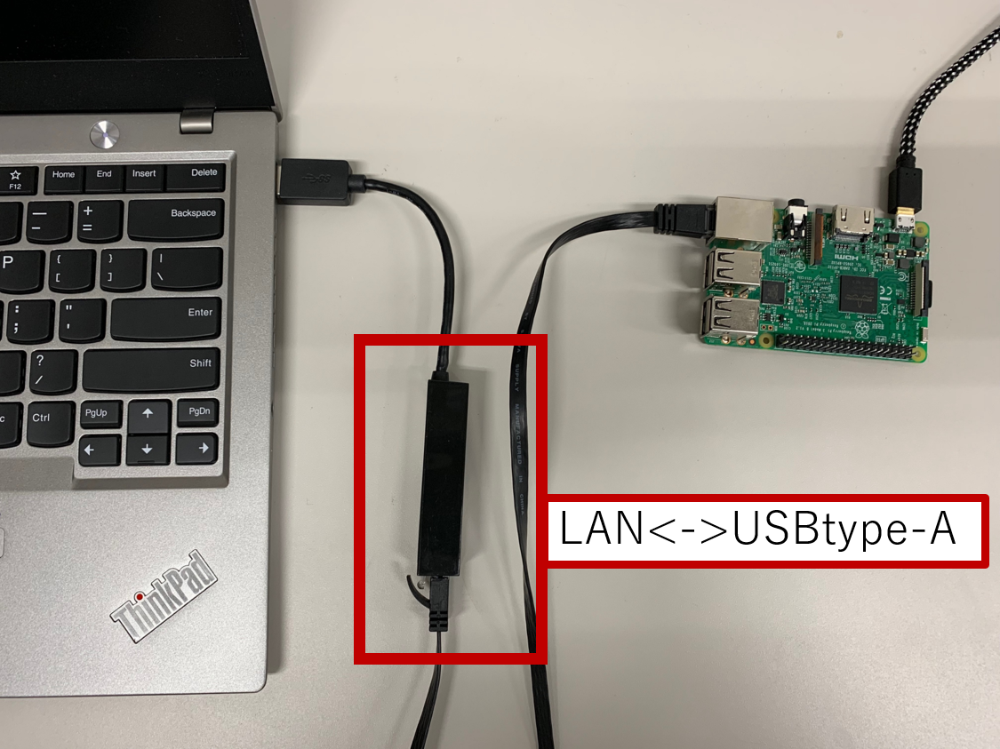
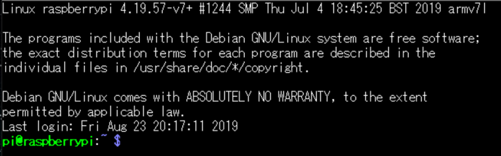

# RSNP チュートリアル2020 RSNPユニット事前準備マニュアル
<h4> 芝浦工業大学 知能機械システム研究室　加藤宏一朗，松日楽　信人</h4>

本システムをご利用予定の方は，お手数ですが下記の連絡先までご連絡ください．また，改善点などのご意見がある方も，下記の連絡先までご連絡ください．**RSNP(Robot Service Network Protocol)をご利用いただくには，使用条件にご同意していただき，RSi事務局にお問い合わせしていただく必要がありますので，ご注意ください．** RSiとRSNPに関しては以下のURLでご参照ください．RSNPユニットのハードウェア，ソフトウェアの仕様に関しては，以下のURLをご参照ください．各種修正履歴に関しては以下のURLをご参照ください．  

[RSiとRSNPに関して](http://robotservices.org/)  
[RSNPユニットの仕様](https://ims-lab8073.github.io/RSNPTutorial2020/Specification.html)  

[メインページ](https://ims-lab8073.github.io/RSNPTutorial2020/)

~~~text  
連絡先：  
芝浦工業大学 機械機能工学科 知能機械システム研究室  
〒135-8548 東京都江東区豊洲3-7-5  
機械工学専攻 修士1年 加藤宏一朗 Koichiro Kato
TEL:03-5859-8073
E-mail:md20024@shibaura-it.ac.jp  
~~~  

<div style="page-break-before:always"></div>

## 1. はじめに  

汎用ユニット(以下，「RSNPユニット」と記載)を，多種多様なロボットやデバイスに外付けで接続することで，取得したデータをRSNP(Robot Serivice Networking Protocol)[2]通信でインターネット経由でサーバにアップロードして蓄積し，Webブラウザ等のGUI上で各ロボットの状態を管理，監視することができる．以下の図のようにRSNPユニットをロボットやデバイスに接続して使用することが可能である．  


**※現状，RSNPユニットは，次のエンドポイントへ接続します．**  
http://robo-lab.mydns.jp:8080/EnqueteRobots2017/services  
  
## 2. ユニットを使用するための準備  

ユニットを使用するためにいくつかのソフトを予め，ダウンロード，インストール，設定する必要があります．ご了承ください．今回は既にインストール済みのものを配布していますので，WiFiの設定のみとなります．  

### 2.1 RSNPユニットの電源投入  

まず，RSNPユニットの電源を入れます．電源ボタンは搭載していないため以下の図に示すように，microUSBにusbケーブルを接続します．OSをシャットダウンしたら，ケーブルを抜いてください．  


<div style="page-break-before:always"></div>  

### 2.2 RSNPユニットを直接操作する場合  

HDMI接続可能なモニタ，USBtype-Aのキーボード，マウスを用意可能である場合は，下の図のように接続することで，PCのように扱うことが可能です．ただし，環境が初めから整っている場合を以外は，次の2.3節に従って接続することも可能です．  



### 2.3 RSNPユニットとPCとの接続  

RSNPユニットの初期設定を行うために，PCと有線で接続します．現状，LANケーブルで接続する方法のみがあります． 
※この方法で接続する場合，予め設定してあるソフトウェアでないと接続できません．ご利用予定の方は，冒頭の連絡先にご連絡ください．  

**LANケーブルとの接続**  
LANケーブルでPCに接続するために，以下の図に示すように配線します．ケーブルの種類は，クロスかストレートのどちらでも接続可能です． PCとの接続には，LANからUSB-typeA変換ハブ，LANからUSB-typeC変換ハブを使用すれば，PCにLANポート(Ethernetポート)が無くても，接続可能です．  

  

LANポート同士で接続した場合  

  

USB-typeAに接続した場合  

  

USB-typeCに接続した場合  

### 2.4 RSNPユニットに接続する  

#### ケース1-Linux，Mac OSの場合  

Linuxを使用している場合，次のコマンドを実行することで，RSNPユニットに接続することができます．  
```shell
~$ ssh pi@rsnpunit.local -p 22
```

#### ケース2-Windowsの場合

RSNPユニットにリモートでSSH接続するためのソフトウェアが必要になります．  
設定すれば，コマンドプロンプトからRSNPユニットへ接続することもできますが，今回は，ソフトウェアを使用します．クライアントソフトウェアとして**Tera Term**を使用します．  

#### 2.4.1 Tera Termのダウンロード＆インストール  
  
以下のサイトより，ダウンロードとインストールを行ってください．  
**窓の杜 Tera Term**  
[https://forest.watch.impress.co.jp/library/software/utf8teraterm/](https://forest.watch.impress.co.jp/library/software/utf8teraterm/)  

<div style="page-break-before:always"></div>  

#### 2.4.2 RSNPユニットに接続  

次に，インストールしたTera Termを起動します．  

以下のような画面が表示されます．  


ここで，ホストに"rsnpunit.local"と，TCPポートに"22"と入力し，"OK"をクリックします．  

#### 2.4.3 Raspberry Piにログイン  

次にRaspberry Piにログインをします．  
上記で"OK"をクリック後に以下のような画面が表示されます．  


ユーザ名に"pi"と，パスフレーズに"8073"と入力し，"OK"をクリックします．  

<div style="page-break-before:always"></div>  

#### ケース1，ケース2-共通  

RSNPユニットに接続すると以下のような画面が表示されます．  



### 2.5 無線LAN接続設定  

RSNPユニットに対して，ロボットやデバイスを接続する場合，有線LANで接続します．しかし，RSNP通信自体は現状，無線LANを使用することを前提としています(1. はじめに 図を参照)．そこで，ここでは無線LANの接続設定を行います．  
まず，接続するルータ等のSSIDとパスワードを調べます．  
次に，`wpa_supplicant.conf`ファイルをエディタで編集します．  

```shell
~$ sudo nano /etc/wpa_supplicant/wpa_supplicant.conf
```

※ファイルを編集するためのエディタとして今回は"nano"を使用していますが，好みのものを使用してください．以下，"nano"を使用します．

次のとおりに追記してください．  

~~~text
network={
     ssid="SSIDを記述"
     psk="パスワードを記述"
}
~~~

次に，RSNPユニットの無線LANを再起動します．以下のようにコマンドを入力し実行します．  
```shell
~$ sudo ifdown wlan0
```

数秒すると無線LANはオフになるので，以下のようにコマンドを入力し実行します．  
```shell
~$ sudo ifup wlan0
```

接続されたか確認のため，以下のようにコマンドを入力し実行します．  
```shell
~$ ifconfig
```

`wlan0:`という項目の`inet`の行に数字の羅列が載っていれば，接続されています．
数字が無い場合は，再度，SSID，パスワードの確認し，RSNPユニットの再起動をしてください．  

再起動のコマンドは，以下のとおりです．  
```shell
~$ sudo reboot
```

なお，シャットダウンのコマンドは，以下のとおりです．  
```shell
~$ sudo poweroff
```

以上で，無線LANの設定は終了になります．  

<div style="page-break-before:always"></div>  

### 2.6 propertiesファイルの設定  

前節でダウンロードした`"DataLog"`ディレクトリに移動します．  
以下のようにコマンドを入力し実行します．  
```shell
~$ cd ~/RSNPUnit/DataLog/
```

移動すると，`"Config.properties"`というファイルがあります．  
次に，以下のようにコマンドを入力します．  

```shell
~$ sudo nano Config.properties
```
デフォルトでは，以下のように記述されています．  

~~~text
Configuration
robot_id  = 2
robot_pw = 8073
end_point = http://robo-lab.mydns.jp:8080/EnqueteRobots2017/services
send_interval = 10000
ip_address = 127.0.0.1
port = 8000
~~~  

各パラメータの意味は，次のようになっています．  

- **robot_id** ： ロボットの識別ID
- **robot_wd**：  ロボット固有のパスワード
- **end_point** ： データを送信するサーバのアドレス  
- **send_interval** ： 送信時間間隔,単位は[ms]
- **ip_address** : RSNPユニット本体のIPアドレス
- **port** ： Socket通信のポート番号  

必要に応じて，これらの各パラメータを変更します．  

<div style="page-break-before:always"></div>  