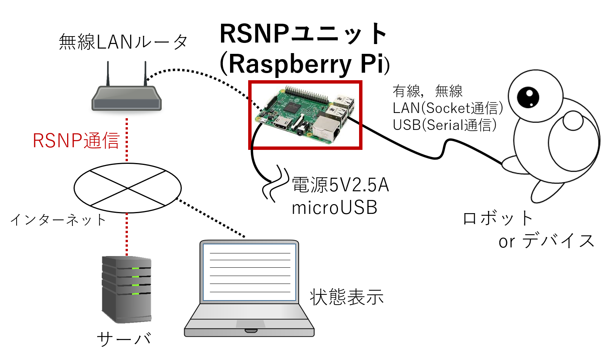
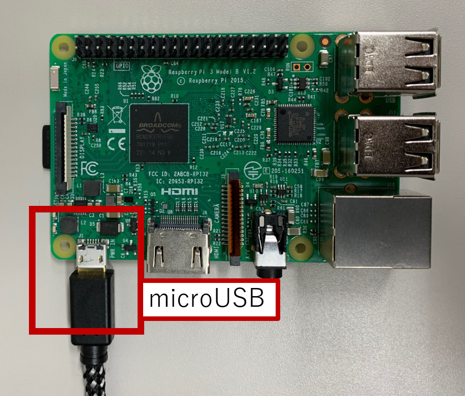
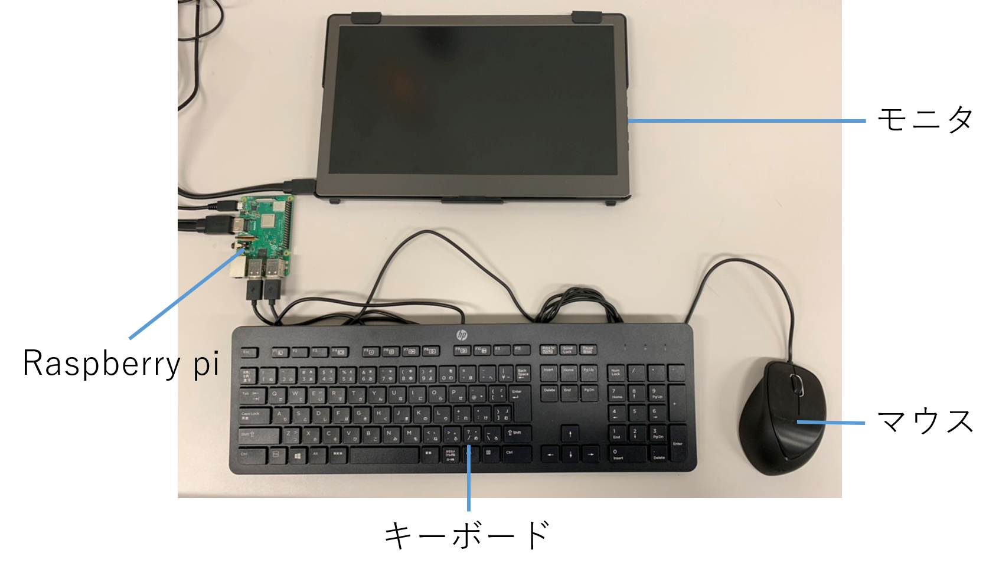
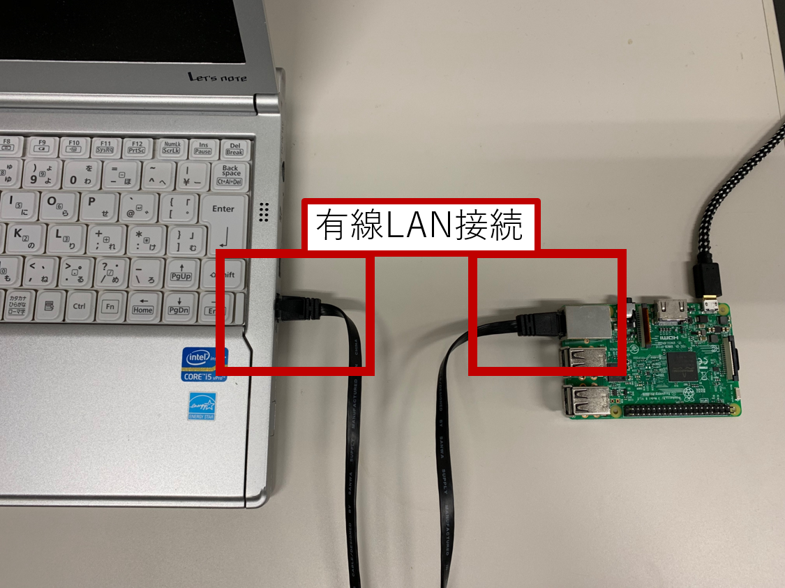
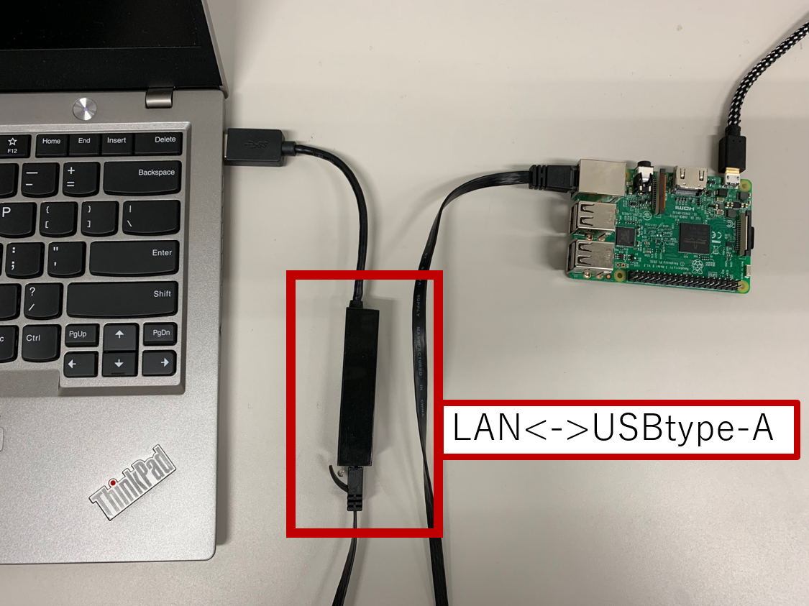
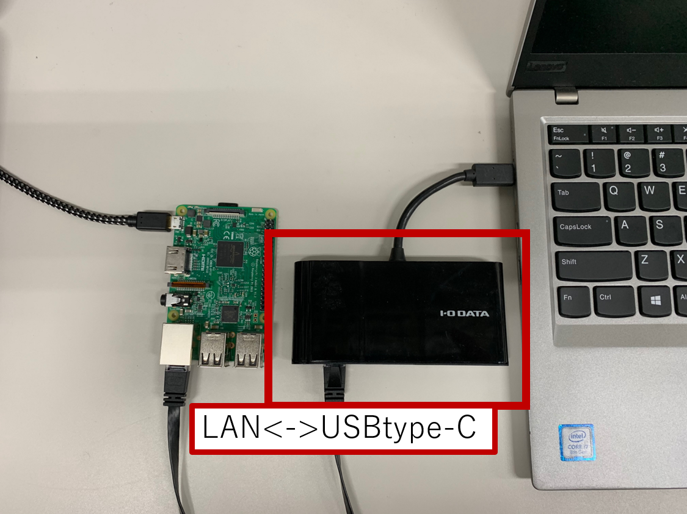
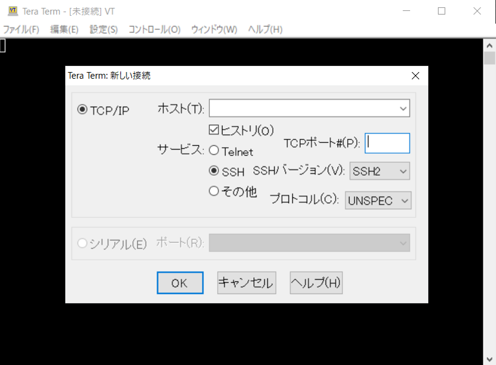
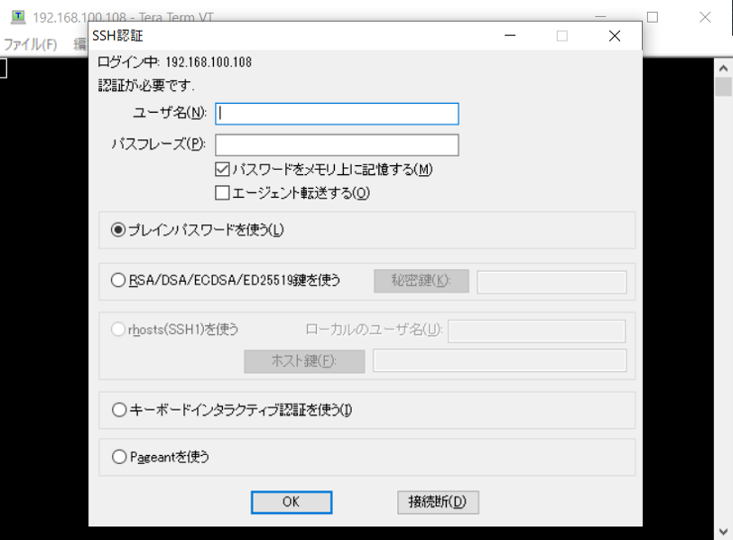
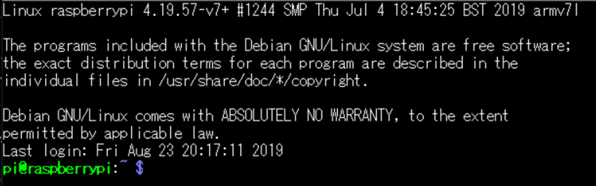
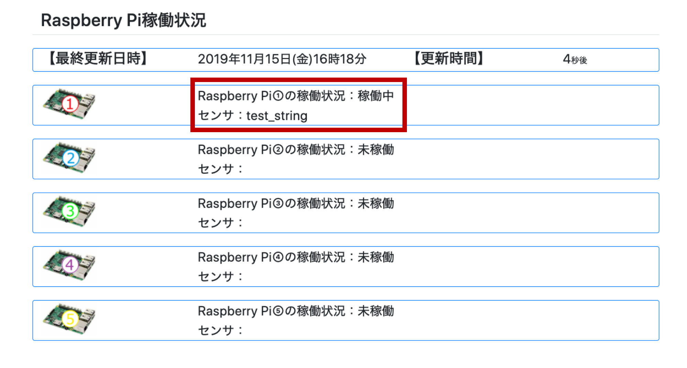

# RSNP チュートリアル2020
<h4> 芝浦工業大学 知能機械システム研究室　加藤宏一朗，松日楽　信人</h4>

本システムをご利用予定の方は，お手数ですが下記の連絡先までご連絡ください．また，改善点などのご意見がある方も，下記の連絡先までご連絡ください．**RSNP(Robot Service Network Protocol)をご利用いただくには，使用条件にご同意していただき，RSi事務局にお問い合わせしていただく必要がありますので，ご注意ください．** RSiとRSNPに関しては以下のURLでご参照ください．RSNPユニットのハードウェア，ソフトウェアの仕様に関しては，以下のURLをご参照ください．各種修正履歴に関しては以下のURLをご参照ください．  

[RSiとRSNPに関して](http://robotservices.org/)  
[RSNPユニットの仕様](https://ims-lab8073.github.io/RSNPTutorial2020/Specification.html)  

~~~text  
連絡先：  
芝浦工業大学 機械機能工学科 知能機械システム研究室  
〒135-8548 東京都江東区豊洲3-7-5  
機械工学専攻 修士1年 加藤宏一朗 Koichiro Kato
TEL:03-5859-8073
E-mail:md20024@shibaura-it.ac.jp  
~~~  

<div style="page-break-before:always"></div>

<h2>目次</h2>

<!-- TOC -->

- [RSNP チュートリアル2020](#rsnp-%E3%83%81%E3%83%A5%E3%83%BC%E3%83%88%E3%83%AA%E3%82%A2%E3%83%AB2020)
    - [はじめに](#%E3%81%AF%E3%81%98%E3%82%81%E3%81%AB)
    - [ユニットを使用するための準備](#%E3%83%A6%E3%83%8B%E3%83%83%E3%83%88%E3%82%92%E4%BD%BF%E7%94%A8%E3%81%99%E3%82%8B%E3%81%9F%E3%82%81%E3%81%AE%E6%BA%96%E5%82%99)
        - [RSNPユニットの電源投入](#rsnp%E3%83%A6%E3%83%8B%E3%83%83%E3%83%88%E3%81%AE%E9%9B%BB%E6%BA%90%E6%8A%95%E5%85%A5)
        - [RSNPユニットを直接操作する場合](#rsnp%E3%83%A6%E3%83%8B%E3%83%83%E3%83%88%E3%82%92%E7%9B%B4%E6%8E%A5%E6%93%8D%E4%BD%9C%E3%81%99%E3%82%8B%E5%A0%B4%E5%90%88)
        - [RSNPユニットとPCとの接続](#rsnp%E3%83%A6%E3%83%8B%E3%83%83%E3%83%88%E3%81%A8pc%E3%81%A8%E3%81%AE%E6%8E%A5%E7%B6%9A)
        - [RSNPユニットに接続する](#rsnp%E3%83%A6%E3%83%8B%E3%83%83%E3%83%88%E3%81%AB%E6%8E%A5%E7%B6%9A%E3%81%99%E3%82%8B)
            - [ケース1-Linux，Mac OSの場合](#%E3%82%B1%E3%83%BC%E3%82%B91-linuxmac-os%E3%81%AE%E5%A0%B4%E5%90%88)
            - [ケース2-Windowsの場合](#%E3%82%B1%E3%83%BC%E3%82%B92-windows%E3%81%AE%E5%A0%B4%E5%90%88)
            - [Tera Termのダウンロード＆インストール](#tera-term%E3%81%AE%E3%83%80%E3%82%A6%E3%83%B3%E3%83%AD%E3%83%BC%E3%83%89%EF%BC%86%E3%82%A4%E3%83%B3%E3%82%B9%E3%83%88%E3%83%BC%E3%83%AB)
            - [RSNPユニットに接続](#rsnp%E3%83%A6%E3%83%8B%E3%83%83%E3%83%88%E3%81%AB%E6%8E%A5%E7%B6%9A)
            - [Raspberry Piにログイン](#raspberry-pi%E3%81%AB%E3%83%AD%E3%82%B0%E3%82%A4%E3%83%B3)
            - [ケース1，ケース2-共通](#%E3%82%B1%E3%83%BC%E3%82%B91%E3%82%B1%E3%83%BC%E3%82%B92-%E5%85%B1%E9%80%9A)
        - [無線LAN接続設定](#%E7%84%A1%E7%B7%9Alan%E6%8E%A5%E7%B6%9A%E8%A8%AD%E5%AE%9A)
        - [propertiesファイルの設定](#properties%E3%83%95%E3%82%A1%E3%82%A4%E3%83%AB%E3%81%AE%E8%A8%AD%E5%AE%9A)
    - [RSNPユニットの動作実行](#rsnp%E3%83%A6%E3%83%8B%E3%83%83%E3%83%88%E3%81%AE%E5%8B%95%E4%BD%9C%E5%AE%9F%E8%A1%8C)
        - [RSNP通信プログラムの実行](#rsnp%E9%80%9A%E4%BF%A1%E3%83%97%E3%83%AD%E3%82%B0%E3%83%A9%E3%83%A0%E3%81%AE%E5%AE%9F%E8%A1%8C)
        - [RSNPユニットに接続する](#rsnp%E3%83%A6%E3%83%8B%E3%83%83%E3%83%88%E3%81%AB%E6%8E%A5%E7%B6%9A%E3%81%99%E3%82%8B)
        - [状態の確認](#%E7%8A%B6%E6%85%8B%E3%81%AE%E7%A2%BA%E8%AA%8D)
    - [RSNPユニットへの通信データ仕様](#rsnp%E3%83%A6%E3%83%8B%E3%83%83%E3%83%88%E3%81%B8%E3%81%AE%E9%80%9A%E4%BF%A1%E3%83%87%E3%83%BC%E3%82%BF%E4%BB%95%E6%A7%98)
    - [参考文献](#%E5%8F%82%E8%80%83%E6%96%87%E7%8C%AE)

<!-- /TOC -->

<div style="page-break-before:always"></div>  

## 1. はじめに  

汎用ユニット(以下，「RSNPユニット」と記載)を，多種多様なロボットやデバイスに外付けで接続することで，取得したデータをRSNP(Robot Serivice Networking Protocol)[2]通信でインターネット経由でサーバにアップロードして蓄積し，Webブラウザ等のGUI上で各ロボットの状態を管理，監視することができる．以下の図のようにRSNPユニットをロボットやデバイスに接続して使用することが可能である．  



**※現状，RSNPユニットは，次のエンドポイントへ接続します．**  
http://robo-lab.mydns.jp:8080/EnqueteRobots2017/services  
  
## 2. ユニットを使用するための準備  

ユニットを使用するためにいくつかのソフトを予め，ダウンロード，インストール，設定する必要があります．ご了承ください．今回は既にインストール済みのものを配布していますので，WiFiの設定のみとなります．  

### 2.1 RSNPユニットの電源投入  

まず，RSNPユニットの電源を入れます．電源ボタンは搭載していないため以下の図に示すように，microUSBにusbケーブルを接続します．OSをシャットダウンしたら，ケーブルを抜いてください．  



<div style="page-break-before:always"></div>  

### 2.2 RSNPユニットを直接操作する場合  

HDMI接続可能なモニタ，USBtype-Aのキーボード，マウスを用意可能である場合は，下の図のように接続することで，PCのように扱うことが可能です．ただし，環境が初めから整っている場合を以外は，次の2.3節に従って接続することも可能です．  



### 2.3 RSNPユニットとPCとの接続  

RSNPユニットの初期設定を行うために，PCと有線で接続します．現状，LANケーブルで接続する方法のみがあります． 
※この方法で接続する場合，予め設定してあるソフトウェアでないと接続できません．ご利用予定の方は，冒頭の連絡先にご連絡ください．  

**LANケーブルとの接続**  
LANケーブルでPCに接続するために，以下の図に示すように配線します．ケーブルの種類は，クロスかストレートのどちらでも接続可能です． PCとの接続には，LANからUSB-typeA変換ハブ，LANからUSB-typeC変換ハブを使用すれば，PCにLANポート(Ethernetポート)が無くても，接続可能です．  

  

LANポート同士で接続した場合  

  

USB-typeAに接続した場合  

  

USB-typeCに接続した場合  

### 2.4 RSNPユニットに接続する  

#### ケース1-Linux，Mac OSの場合  

Linuxを使用している場合，次のコマンドを実行することで，RSNPユニットに接続することができます．  
```shell
~$ ssh pi@rsnpunit.local -p 22
```

#### ケース2-Windowsの場合

RSNPユニットにリモートでSSH接続するためのソフトウェアが必要になります．  
設定すれば，コマンドプロンプトからRSNPユニットへ接続することもできますが，今回は，ソフトウェアを使用します．クライアントソフトウェアとして**Tera Term**を使用します．  

#### 2.4.1 Tera Termのダウンロード＆インストール  
  
以下のサイトより，ダウンロードとインストールを行ってください．  
**窓の杜 Tera Term**  
[https://forest.watch.impress.co.jp/library/software/utf8teraterm/](https://forest.watch.impress.co.jp/library/software/utf8teraterm/)  

<div style="page-break-before:always"></div>  

#### 2.4.2 RSNPユニットに接続  

次に，インストールしたTera Termを起動します．  

以下のような画面が表示されます．  



ここで，ホストに"rsnpunit.local"と，TCPポートに"22"と入力し，"OK"をクリックします．  

#### 2.4.3 Raspberry Piにログイン  

次にRaspberry Piにログインをします．  
上記で"OK"をクリック後に以下のような画面が表示されます．  



ユーザ名に"pi"と，パスフレーズに"8073"と入力し，"OK"をクリックします．  

<div style="page-break-before:always"></div>  

#### ケース1，ケース2-共通  

RSNPユニットに接続すると以下のような画面が表示されます．  



### 2.5 無線LAN接続設定  

RSNPユニットに対して，ロボットやデバイスを接続する場合，有線LANで接続します．しかし，RSNP通信自体は現状，無線LANを使用することを前提としています(1. はじめに 図を参照)．そこで，ここでは無線LANの接続設定を行います．  
まず，接続するルータ等のSSIDとパスワードを調べます．  
次に，`wpa_supplicant.conf`ファイルをエディタで編集します．  

```shell
~$ sudo nano /etc/wpa_supplicant/wpa_supplicant.conf
```

※ファイルを編集するためのエディタとして今回は"nano"を使用していますが，好みのものを使用してください．以下，"nano"を使用します．

次のとおりに追記してください．  

~~~text
network={
     ssid="SSIDを記述"
     psk="パスワードを記述"
}
~~~

次に，RSNPユニットの無線LANを再起動します．以下のようにコマンドを入力し実行します．  
```shell
~$ sudo ifdown wlan0
```

数秒すると無線LANはオフになるので，以下のようにコマンドを入力し実行します．  
```shell
~$ sudo ifup wlan0
```

接続されたか確認のため，以下のようにコマンドを入力し実行します．  
```shell
~$ ifconfig
```

`wlan0:`という項目の`inet`の行に数字の羅列が載っていれば，接続されています．
数字が無い場合は，再度，SSID，パスワードの確認し，RSNPユニットの再起動をしてください．  

再起動のコマンドは，以下のとおりです．  
```shell
~$ sudo reboot
```

なお，シャットダウンのコマンドは，以下のとおりです．  
```shell
~$ sudo poweroff
```

以上で，無線LANの設定は終了になります．  

<div style="page-break-before:always"></div>  

### 2.6 propertiesファイルの設定  

前節でダウンロードした`"DataLog"`ディレクトリに移動します．  
以下のようにコマンドを入力し実行します．  
```shell
~$ cd ~/RSNPUnit/DataLog/
```

移動すると，`"Config.properties"`というファイルがあります．  
次に，以下のようにコマンドを入力します．  

```shell
~$ sudo nano Config.properties
```
デフォルトでは，以下のように記述されています．  

~~~text
Configuration
robot_id  = 2
robot_pw = 8073
end_point = http://robo-lab.mydns.jp:8080/EnqueteRobots2017/services
send_interval = 10000
ip_address = 127.0.0.1
port = 8000
~~~  

各パラメータの意味は，次のようになっています．  

- **robot_id** ： ロボットの識別ID
- **robot_wd**：  ロボット固有のパスワード
- **end_point** ： データを送信するサーバのアドレス  
- **send_interval** ： 送信時間間隔,単位は[ms]
- **ip_address** : RSNPユニット本体のIPアドレス
- **port** ： Socket通信のポート番号  

必要に応じて，これらの各パラメータを変更します．  

<div style="page-break-before:always"></div>  

## 3 RSNPユニットの動作実行  

プログラムを起動してから，接続する必要があるので注意してください．  

### 3.1 RSNP通信プログラムの実行  
まず，`"RSNPNotifi.jar"`を実行します．  
`RSNPUnit`ディレクトリに移動するため，以下のようにコマンドを入力します．  

```shell
~$ cd ~/RSNPUnit
```

次に，実行するために以下のようにコマンドを入力します．  
```shell
~$ java -jar RSNPNotifi.jar
```
※現状，jdk1.8以下で動作します．jdk10以上では動作しませんのでご注意ください．  

停止するときは，"Ctrl"+"c"キーを入力することで停止します．  

### 3.2 RSNPユニットに接続する
RSNPNotifi.jarに接続するサンプルのPythonプログラムがあります．
新しい接続画面を開いてください．(2.4 RSNPユニットに接続する 参照)

まず，Pythonファイルのある場所に移動します．

```shell
~$ cd ~/RSNPUnit/ConnectorSample
```

その後，Pythonファイルを実行します．

```shell
~$ python Socket_sample.py
```

`Input data and enter`と出てくるので好きな文字を入力してEnterを押します．
```shell
~$ Input data and enter
~$ RSNPチュートリアル(入力)
~$ send data : {"data":[{"ac_id":"1","ac":"robot_state","re_id":"1","re":"RSNPチュートリアル","co":""}]}
```

### 3.3 状態の確認  

ロボットまたはデバイスからRSNPユニットにデータを送信すると，RSNPでサーバに送信されます．
サーバにアクセスすることでWebブラウザ上に状態が反映されているか確認することができます．  

デフォルト設定のままの場合，以下のURLにアクセスすることで確認することができます．  
[http://robo-lab.mydns.jp:8080/Robomech2019/](http://robo-lab.mydns.jp:8080/Robomech2019/)

以下のようにブラウザ上で表示されていれば，確認完了です．  
今回は，単にRaspberryPiの稼働状況と，それに接続されたセンサの状態を表示する一例となっています．

"robot_id"=1のロボットで"result"="test_string"を送信した例を下の図に示す．  
  

他にもロボットの画像に差し替えたり，表示するデータの種類も変更して表示情報を変更することができます．  

## 4. RSNPユニットへの通信データ仕様

RSNPユニットからロボットまたはデバイス間のデータのやり取りはSocket,Serial通信で行います．  
送信データは現状，**文字列型データ**です．ただし，以下の5種類のデータで定義づける必要があります．  

- **Action_id**
- **Action名**  
- **Result_id**  
- **Resultデータ**  
- **コメント**  

各データの意味は，次のようになっています．
**Action_id**とは，**Action名**に対する紐づけidです．  
**Action名**とは，ロボットが行った動作名などです．  
**Result_id**とは，**Resultデータ**に対する紐づけidです．  
**Resultデータ**とは，ロボットから得たデータ(変数)などです．  
**コメント**とは，コメント記述を入れたい場合に用います．  
例えば，挨拶を3回，人数カウントを5人としたロボットがあったとします．この場合，データの仕様は次のようになります．  

|     データ名     | データ1  | データ2 |
| :--------------: | :------: | :-----: |
|  **Action_id**   |    1     |    2    |
|   **Action名**   | 挨拶回数 |  人数   |
|  **Result_id**   |    1     |    2    |
| **Resultデータ** |    3     |    5    |
|   **コメント**   |   無し   |  無し   |

ここで，実際のデータ形式は以下のようなjson形式としてます．`{...}`内において，先頭に`「"data":」`があり，その次に配列のカッコ(`[]`)内において，1種類のデータが配列の1つの要素に入ります．ダブルクォーテーション(`"`)で囲んだ仕様名と値をカンマ(`:`)で区切ります．3点(`...`)には，対応するデータ等が入ります．見やすいように改行してありますが，実際は1行でデータ送信してください．これ以外の仕様でのデータを送信するとRSNPユニット側で受信できないのでご注意ください．  

~~~text
{  
  "data":  
  [  
    {  
      "ac_id": ... ,  
      "ac": ... ,  
      "re_id": ... ,  
      "re": ... ,  
      "co": ...  
    },  
    {...},  
    ...  
  ]  
}  
~~~  

データ名は以下の表のように短縮形となっているのでご注意ください．  

|     データ名     |  省略形   |
| :--------------: | :-------: |
|  **Action_id**   | **ac_id** |
|   **Action名**   |  **ac**   |
|  **Result_id**   | **re_id** |
| **Resultデータ** |  **re**   |
|   **コメント**   |  **co**   |

上記のロボットの例の場合は，  
`{"data":[{"ac_id":"1","ac":"挨拶回数","re_id":"1","re":3,"co":""},{"ac_id":"2","ac":"人数","re_id":"2","re":5,"co":""}]}`  
となります(コメントは無しのため，空欄("")となっています)．つまり，最終的にこのデータ形式で**文字列型データ**で送信することになります．  
データが複数種類の場合は，配列の成分が増加し，  
``{"data":[{...},{...},{...},...]}``  
となります．今回は5種類まで対応しています．  


## 参考文献  
[1] NEDO "2035年までのロボット産業の将来市場予測"，http://www.nedo.go.jp/content/100080673.pdf, 最終閲覧日2019年8月20日  
[2] ロボットサービスイニシアチブ，Robot Service Network Protocol2.3 仕様書 第1.0版，2010  
[3] OpenRTM-aist, https://openrtm.org/openrtm/ja, 最終閲覧日2019年8月20日  
[4] ROS Wiki, http://wiki.ros.org/ja, 最終閲覧日2019年8月20日  